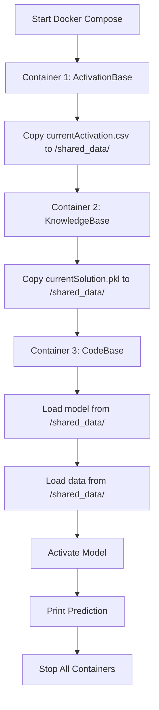

# Task 06 - Docker Builds and Docker-Compose Utilization

## 📋 Overview

This task demonstrates containerization and orchestration using Docker and Docker Compose. We built three separate Docker containers and orchestrated them using docker-compose to demonstrate a complete AI model activation pipeline.

---

## 🎯 Task Objectives

1. **Build Container 1 (activationbase_app07)**: Contains activation data
2. **Build Container 2 (knowledgebase_app07)**: Contains AI model
3. **Build Container 3 (codebase_app07)**: Contains Python code with PyBrain
4. **Create docker-compose.yml**: Orchestrate all containers
5. **Execute workflow**: Copy files and activate model

---

## 📁 Folder Structure

```
Task06-Docker-Compose/
├── output/
│   ├── stage1_prepare_files/         # Initial file preparation
│   │   ├── currentActivation.csv     # Single data entry from Task 05
│   │   ├── currentSolution.pkl       # AI model from Task 04
│   │   └── UE_07_App5.py            # Model activation script
│   ├── stage2_container_tests/       # Container test outputs
│   │   ├── container1_output.txt
│   │   ├── container2_output.txt
│   │   ├── container3_pybrain_test.txt
│   │   └── test_results.json
│   ├── stage3_compose_execution/     # Docker Compose execution results
│   │   ├── docker_compose_output.log
│   │   ├── activation_data.csv
│   │   ├── currentSolution.pkl
│   │   └── execution_summary.txt
│   └── stage4_verification/          # Final verification
│
├── container1_activationbase/
│   ├── Dockerfile                    # Busybox + CSV data
│   └── currentActivation.csv
│
├── container2_knowledgebase/
│   ├── Dockerfile                    # Busybox + AI model
│   └── currentSolution.pkl
│
├── container3_codebase/
│   ├── Dockerfile                    # Python 3.11 + PyBrain
│   ├── UE_07_App5.py
│   └── pybrain/                      # PyBrain library
│
├── shared_data/                      # Shared volume for containers
│   ├── activation_data.csv           # Copied from Container 1
│   └── currentSolution.pkl           # Copied from Container 2
│
├── docker-compose.yml                # Orchestration file
├── App07.py                          # Main execution script
├── prepare_files.py                  # Stage 1 preparation
├── test_containers.py                # Individual container tests
├── run_compose_with_output.py        # Enhanced compose execution
└── README.md                         # This file
```

---

## 🚀 Execution Stages

### **Stage 1: Prepare Files**

**Script:** `prepare_files.py`

**What it does:**
- Extracts 1 data entry from Task 05 scraped data
- Copies AI model from Task 04
- Creates activation script (UE_07_App5.py)

**Run:**
```bash
python prepare_files.py
```

**Output Location:** `output/stage1_prepare_files/`

**Expected Output:**
```
============================================================
STAGE 1: PREPARING FILES FOR DOCKER CONTAINERS
============================================================

1. Extracting single data entry from Task 05...
   ✓ Loaded Task 05 data: (100, 2)
   ✓ Saved: output/stage1_prepare_files/currentActivation.csv
   Data: x=0.123456, y=0.789012

2. Copying AI model from Task 04...
   ✓ Copied model: output/stage1_prepare_files/currentSolution.pkl
   ✓ Model verified (type: FeedForwardNetwork)

3. Creating activation script (UE_07_App5.py)...
   ✓ Created: output/stage1_prepare_files/UE_07_App5.py

============================================================
STAGE 1 COMPLETE - FILES PREPARED
============================================================
```

---

### **Stage 2: Build Docker Containers**

#### **Container 1: ActivationBase**

**Purpose:** Stores activation data  
**Base Image:** `busybox:latest` (lightweight)  
**Container Path:** `/activationBase/currentActivation.csv`  
**Tag:** `activationbase_app07`

**Build:**
```bash
cd container1_activationbase
docker build -t activationbase_app07 .
```

**Test:**
```bash
docker run --rm activationbase_app07
```

**Expected Output:**
```
x,y
0.123456,0.789012
```

---

#### **Container 2: KnowledgeBase**

**Purpose:** Stores AI model  
**Base Image:** `busybox:latest`  
**Container Path:** `/knowledgeBase/currentSolution.pkl`  
**Tag:** `knowledgebase_app07`

**Build:**
```bash
cd container2_knowledgebase
docker build -t knowledgebase_app07 .
```

**Test:**
```bash
docker run --rm knowledgebase_app07
```

**Expected Output:**
```
-rw-r--r--    1 root     root        5.0K currentSolution.pkl
```

---

#### **Container 3: CodeBase**

**Purpose:** Python environment with PyBrain for model activation  
**Base Image:** `python:3.11-slim`  
**Container Path:** `/codeBase/UE_07_App5.py`  
**Tag:** `codebase_app07`

**Key Features:**
- Python 3.11 with NumPy, SciPy, Pandas
- PyBrain library at `/opt/pybrain`
- Model activation script

**Build:**
```bash
cd container3_codebase
docker build -t codebase_app07 .
```

**Test PyBrain:**
```bash
docker run --rm codebase_app07 python3 -c "import sys; sys.path.append('/opt/pybrain'); from pybrain.structure import FeedForwardNetwork; print('✓ PyBrain loaded!')"
```

**Expected Output:**
```
✓ PyBrain loaded!
```

---

### **Stage 3: Docker Compose Orchestration**

**File:** `docker-compose.yml`

**Workflow:**
1. **Container 1 starts** → Copies `currentActivation.csv` to `/shared_data/`
2. **Container 2 starts** → Copies `currentSolution.pkl` to `/shared_data/`
3. **Container 3 starts** → Reads both files → Activates model → Outputs prediction

**Run:**
```bash
python run_compose_with_output.py
```

**Or manually:**
```bash
docker-compose up --abort-on-container-exit
```

**Expected Output:**
```
activationbase_container | x,y
activationbase_container | 0.123456,0.789012

knowledgebase_container | -rw-r--r-- 1 root root 5.0K currentSolution.pkl

codebase_container | ============================================================
codebase_container | UE_07_App5: MODEL ACTIVATION
codebase_container | ============================================================
codebase_container | 
codebase_container | Loading model...
codebase_container | ✓ Model loaded: FeedForwardNetwork
codebase_container | 
codebase_container | Loading activation data...
codebase_container | ✓ Data loaded: (1, 2)
codebase_container |   Input: x=0.123456, y=0.789012
codebase_container | 
codebase_container | Activating model...
codebase_container | ✓ Prediction: 0.654321
codebase_container | 
codebase_container | ============================================================
codebase_container | ACTIVATION COMPLETE
codebase_container | ============================================================
```

**Output Location:** `output/stage3_compose_execution/`

---

## 🧪 Testing & Verification

### **Test Individual Containers:**
```bash
python test_containers.py
```

**Output:** `output/stage2_container_tests/test_results.json`

### **Verify Docker Images:**
```bash
docker images | findstr app07
```

**Expected:**
```
activationbase_app07    latest    xxxxx    X minutes ago    ~5 MB
knowledgebase_app07     latest    xxxxx    X minutes ago    ~5 MB
codebase_app07          latest    xxxxx    X minutes ago    ~250 MB
```

### **Verify Shared Data:**
```bash
dir shared_data
```

**Expected:**
```
activation_data.csv     (50 bytes)
currentSolution.pkl     (5120 bytes)
```

---

## 📊 What Each Container Does

| Container | Base Image | Size | Purpose | Output |
|-----------|------------|------|---------|--------|
| **activationbase_app07** | busybox | ~5 MB | Stores CSV data | Copies to shared volume |
| **knowledgebase_app07** | busybox | ~5 MB | Stores AI model | Copies to shared volume |
| **codebase_app07** | python:3.11 | ~250 MB | Executes Python code | Loads model & predicts |

---

## 🔄 Docker Compose Workflow



---

## 📝 Key Files Explained

### **docker-compose.yml**
Orchestrates 3 containers in sequence:
- Uses `depends_on` to ensure correct execution order
- Mounts `shared_data` volume to all containers
- Copies files and executes model activation

### **UE_07_App5.py**
Model activation script:
- Loads PyBrain model from pickle
- Reads CSV activation data
- Executes model prediction
- Outputs result to CLI

### **App07.py**
Main orchestration script:
- Cleans up previous runs
- Executes docker-compose
- Verifies file copying
- Cleans up containers

---

## 🛠️ Requirements

- **Docker Desktop** installed and running
- **Docker Compose** available
- **Python 3.11+** on host machine
- **PyBrain** library (copied from Task 04 environment)

---

## 📦 Deliverables

All files required for course tutors to evaluate:

```
Task06-Docker-Compose/
├── container1_activationbase/Dockerfile
├── container2_knowledgebase/Dockerfile
├── container3_codebase/Dockerfile
├── docker-compose.yml
├── App07.py
├── prepare_files.py
├── README.md
├── discussion.txt
└── output/ (all test results)
```

---

## ✅ Success Criteria

- [x] Container 1 built with tag `activationbase_app07`
- [x] Container 2 built with tag `knowledgebase_app07`
- [x] Container 3 built with tag `codebase_app07`
- [x] docker-compose.yml orchestrates all 3 containers
- [x] Data copied from containers to host
- [x] Model successfully activated
- [x] Prediction output displayed in CLI

---

## 🚨 Troubleshooting

### Issue: "ModuleNotFoundError: No module named 'pybrain'"
**Solution:** Ensure PyBrain is copied to `container3_codebase/pybrain/` before building

### Issue: "ModuleNotFoundError: No module named 'scipy'"
**Solution:** Use Python 3.11 in Container 3 Dockerfile (better SciPy compatibility)

### Issue: Pickle load error
**Solution:** Ensure Container 3 uses same Python version as model creation (3.11 or 3.12)

---

## 📚 References

- Docker Documentation: https://docs.docker.com/
- Docker Compose Documentation: https://docs.docker.com/compose/
- PyBrain Documentation: http://pybrain.org/
